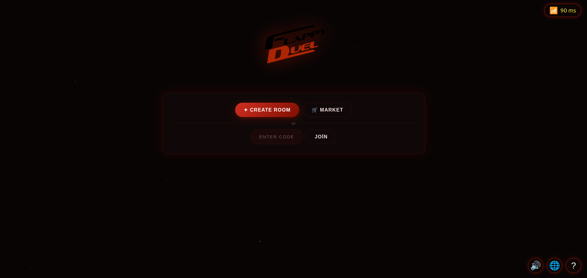
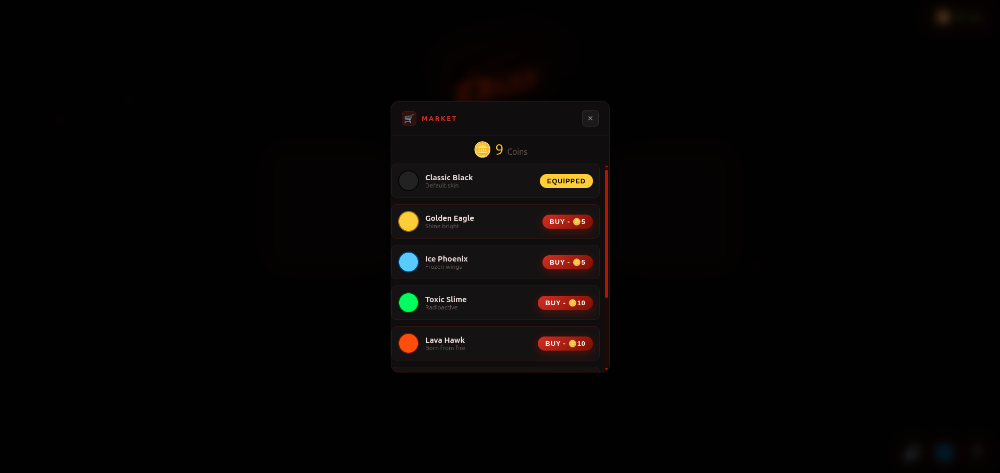
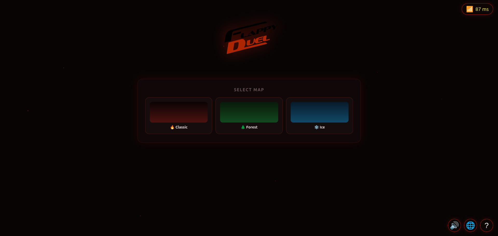
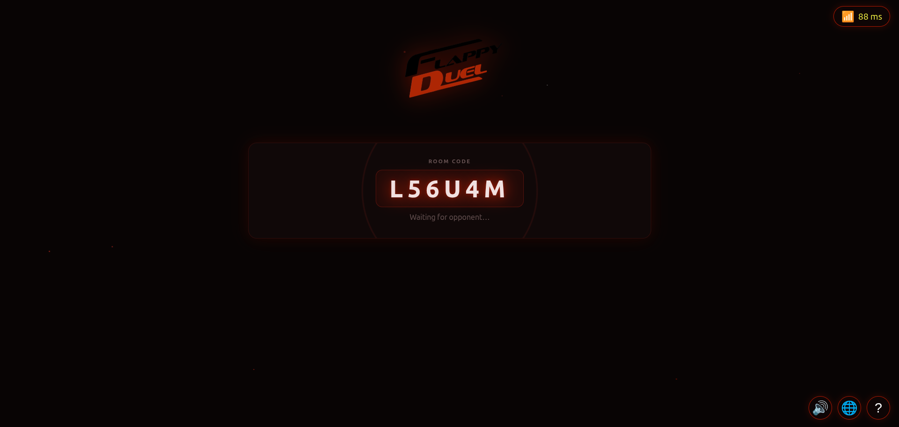
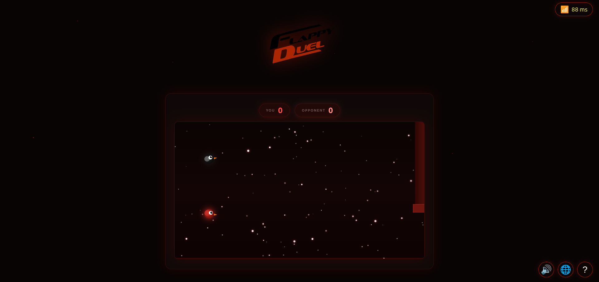
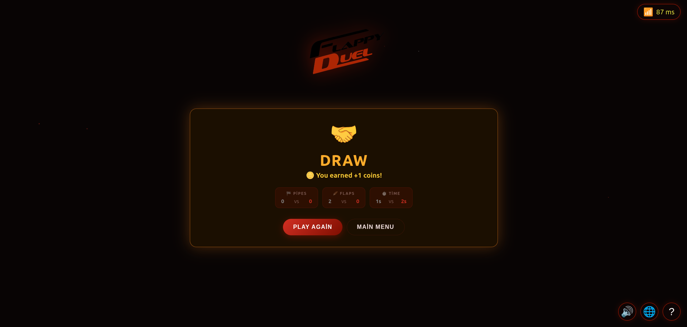
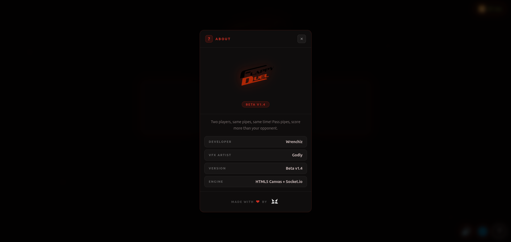
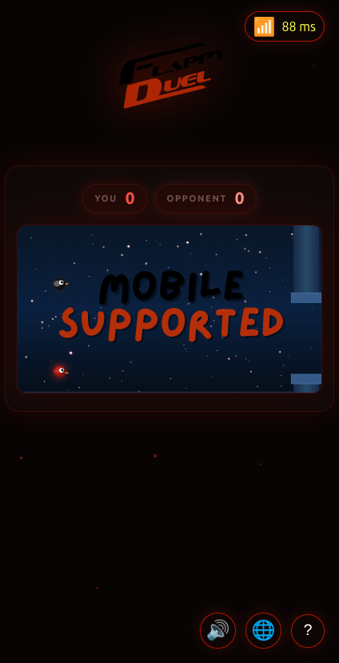

# Flappy Duel (v0.1.4-beta)
Made With ❤️ by **Phantomware**
> **Developer:** Wrenchiz  
> **Version:** v0.1.4-beta  
> **Engine:** HTML5 Canvas + Socket.io  
> **Live Open Beta:** [https://flappy-duel.onrender.com/](https://flappy-duel.onrender.com/)  

---

## 📸 Screenshots

  

  

  

  

  

  

  

  

---

# Phantomware Official Website

> **Official Website:** [https://phantomware.netlify.app/](https://phantomware.netlify.app/)

---

## ⚖️ License

This project is licensed under a **Proprietary Source-Available License**.  
Source code is made publicly visible solely for transparency, security auditing, and verification purposes.  
See the [LICENSE](LICENSE.md) file for full terms and conditions.

© 2026 **Phantomware**. All rights reserved.
